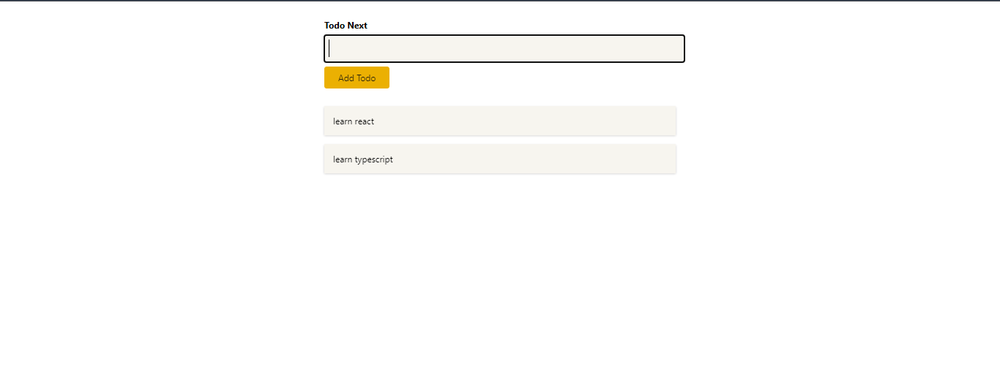

<div id="top"></div>

[](https://react.dev/)


<!-- PROJECT LOGO -->
<br />
<div align="center">
  <a href="https://typodo-5f094.web.app/">
    
  </a>
  <h1 align="center">Typodo</h1>

  <p align="center">
    <a href="https://challengesphere-a9609.web.app/">View Demo</a>
    ·
    <a href="https://github.com/SalahShallapy/Typodo/issues">Report Bug</a>
  </p>
</div>

A fully type-safe Todo List application built with TypeScript and React, demonstrating the use of advanced TypeScript concepts, context API, and reusable components.

## Project Overview



## Features

- Type Safety: Leverages TypeScript to ensure type safety throughout the app.
- Context API Integration: Manages state effectively using React's context API.
- Generics Usage: Implements reusable and type-safe logic using TypeScript generics.
- Component Reusability: Modular and reusable React components like NewTodo and Todos.
- Dynamic State Updates: Enables adding and removing todos dynamically with real-time updates.
- Error Handling: Ensures clean user interactions with basic form validations.
- CSS Modules: Scoped styling for better maintainability.

## How It Works

1.  Add a Todo: Type a task into the input field and click "Add Todo." The new task will appear in the list.
2.  Remove a Todo: Click on a task to remove it from the list.
3.  Context Management: The app uses a context provider to manage todos globally.
4.  TypeScript Integration:
    - useRef ensures type safety for the input element.
    - Custom Todo class defines the structure for each task.
    - Context API uses a todosContextObj type for consistent data handling.

## Project Structure

```
Typodo
│      .gitignore
│      package-lock.json
│      package.json
│      README.md
│      tsconfig.js
│
└───public -----> all images
│
└───src
    │   App.tsx
    │   App.css
    │   index.tsx
    │   index.css
    |   react-app-env.d.ts
    │
    ├───components
    │      NewTodo.module.css
    │      NewTodo.tsx
    │      TodoItem.module.css
    │      TodoItem.tsx
    │      Todos.module.css
    │      Todos.tsx
    │
    ├───models
    │      todo.ts
    │
    ├───store
    │      todos-context.jsx
    │
```

## Installation

To get started with the project locally:

1. Clone the repository:
   ```bash
   git clone https://github.com/SalahShallapy/Typodo.git
   ```
2. Navigate to the project directory:
   ```bash
   cd Typodo
   ```
3. Install dependencies:
   ```bash
   npm install
   ```
4. Run the project:
   ```bash
   npm start
   ```

## Contributing

Contributions are what make the open source community such an amazing place to learn, inspire, and create. Any contributions you make are **greatly appreciated**.

If you have a suggestion that would make this better, please fork the repo and create a pull request. You can also simply open an issue with the tag "enhancement".
Don't forget to give the project a star! Thanks!

1. Fork the Project
2. Create your Feature Branch (`git checkout -b feature/AmazingFeature`)
3. Commit your Changes (`git commit -m 'Add some AmazingFeature'`)
4. Push to the Branch (`git push origin feature/AmazingFeature`)
5. Open a Pull Request

<p align="right">(<a href="#top">back to top</a>)</p>
